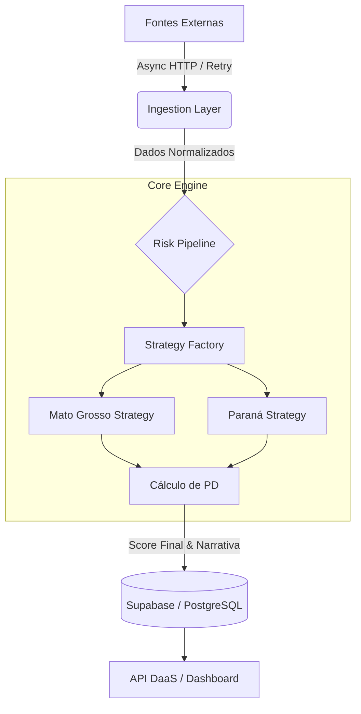

# Agro Risk Engine (Enterprise Core) 🚜


**Motor de Modelagem de Risco de Crédito Agrícola (Credit Risk Engine) de alta performance.**

> **Contexto:** Este repositório contém o *core backend* de uma plataforma DaaS (Data-as-a-Service) desenvolvida originalmente para fins comerciais. O código foi aberto (Open Sourced) para demonstrar arquitetura de software robusta, engenharia de dados avançada e modelagem quantitativa aplicada ao agronegócio.

## 🎯 O Problema de Negócio

Modelos de crédito tradicionais (bancários) falham no agronegócio porque olham apenas para o passado (Bureaus/Serasa). Eles não detectam quando um produtor é tecnicamente solvente, mas está operacionalmente quebrado devido a fatores externos.

**A Solução:**
Este motor implementa uma análise multidimensional em tempo real, correlacionando:
1.  **Mercado Global (CBOT):** Volatilidade de preços e paridade de exportação.
2.  **Logística Local:** Custo de frete e gargalos portuários (Risco de Base).
3.  **Climatologia:** Impacto de anomalias hídricas na produtividade da safra.

O resultado é um **PD (Probability of Default) Dinâmico**, capaz de prever crises de liquidez antes do vencimento dos contratos.

## 🏗 Arquitetura & Engenharia

O sistema foi desenhado seguindo princípios de **Modular Monolith**, priorizando a integridade dos dados e a resiliência da ingestão.

### 📐 Diagrama de Fluxo de Dados



### Destaques Técnicos

*   **Ambiente Hermético (Nix & uv):** Abandono do `pip` tradicional em favor do `uv` (Rust-based) e `Nix`, garantindo que o ambiente de desenvolvimento seja 100% reprodutível, bit-a-bit, em qualquer máquina.
*   **Ingestão Assíncrona Resiliente:** O pipeline de dados (`core/pipeline.py`) utiliza `asyncio` e `httpx` com implementação manual de **Semáforos** para controle de concorrência (Backpressure) e **Exponential Backoff** para lidar com falhas de API externas.
*   **Design Patterns Aplicados:**
    *   **Strategy Pattern:** Para isolar regras de risco regionais (ex: `MatoGrossoStrategy` vs `ParanaStrategy`).
    *   **Factory Pattern:** Para instanciar os motores de cálculo dinamicamente.
    *   **Singleton:** Gerenciamento eficiente de conexões de banco de dados (`core/db.py`).
*   **Audit Trail:** Todo dado ingerido possui rastreabilidade de fonte e timestamp, requisito fundamental para auditoria em instituições financeiras.

## 🧠 Deep Dive: A Lógica Quantitativa

O coração do sistema (`core/engine.py`) opera uma máquina de estados baseada em 4 vetores de risco:

### 1. Modelagem de "Washout" (Default Estratégico)
Calcula a probabilidade matemática de um produtor quebrar o contrato propositalmente.
*   *Lógica:* Se `Preço Atual` > `Preço Contratado + Multa` E `Produtividade` < `Break-even`, o risco é máximo.
*   *Implementação:* `core/indicators/fundamental.py`

### 2. Proxy de Demanda Chinesa
Monitoramento antecipado de demanda via correlação cruzada.
*   *Lógica:* O spread entre futuros de **Suínos (Lean Hogs)** e **Farelo de Soja** na China antecipa a demanda de exportação brasileira em ~3 semanas.

### 3. Sensibilidade Fenológica
O risco climático é ponderado pelo calendário agrícola.
*   *Lógica:* Uma seca de 10 dias em Janeiro (enchimento de grão) tem peso 5x maior no score do que uma seca em Abril (colheita).
*   *Implementação:* `core/seasonality.py`

### 4. Indicadores Financeiros (Terms of Trade)
*   **Crush Margin:** Viabilidade da indústria esmagadora.
*   **Efeito Tesoura:** Relação de troca entre Receita (Soja) e Custo (Insumos/Petróleo).

## 🚀 Como Executar (Localmente)

Este projeto utiliza ferramentas modernas. Certifique-se de ter o [uv](https://docs.astral.sh/uv/) instalado.

1.  **Clone o repositório:**
    ```bash
    git clone https://github.com/SEU_USUARIO/agro-risk-engine.git
    cd agro-risk-engine
    ```

2.  **Configuração de Ambiente:**
    Crie um arquivo `.env` na raiz (baseado no `.env.example`).
    > **Nota:** O sistema possui *fallbacks* para dados sintéticos caso as chaves de API (Supabase/WeatherAPI) não estejam presentes, permitindo a execução da demo.

3.  **Instalação de Dependências:**
    ```bash
    uv pip install -r requirements.txt
    ```

4.  **Seed de Dados (Simulação):**
    Popula o banco com uma carteira de crédito fictícia para teste de estresse.
    ```bash
    uv run python -m scripts.seed_portfolio
    ```

5.  **Execução do Pipeline:**
    ```bash
    uv run python main.py --mode watch
    ```

## 🛠 Stack Tecnológica

*   **Linguagem:** Python 3.10+
*   **Gerenciamento de Pacotes:** uv (Astral)
*   **Ambiente:** Nix (via devenv)
*   **Banco de Dados:** PostgreSQL (Supabase)
*   **Bibliotecas Chave:** Pandas, NumPy, Pydantic, HTTPX, AsyncIO.

---
**Autor:** Raphael Soares
*Data Engineer & Software Architect*
[LinkedIn](https://www.linkedin.com/in/raphaelsoaresc/) | [Portfolio](https://github.com/raphaelsoaresc)
```